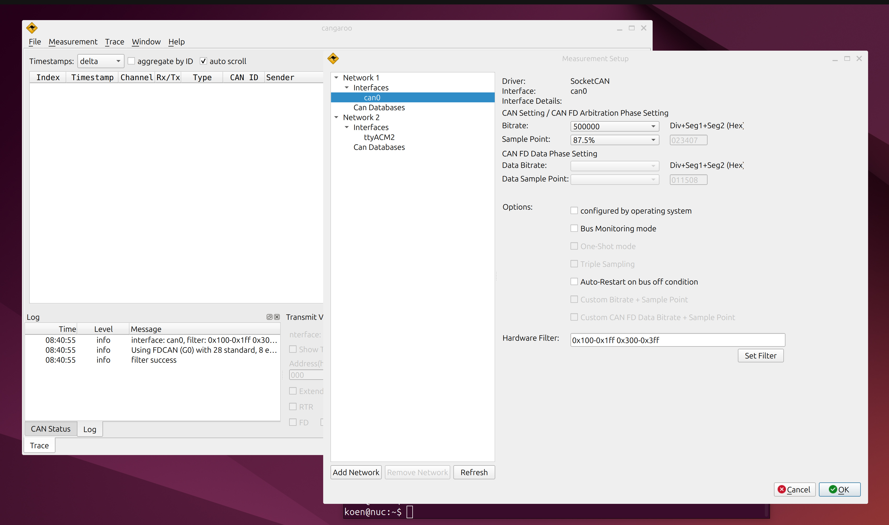

# cangaroo hardware filtering demo

 

This is initial hardware filtering support for cangaroo on linux.

Requires candlelight [usb-to-can adapters with support for hardware filtering](https://github.com/candle-usb/candleLight_fw/pull/204).

A few notes:

- Platform: Currently Linux-only.
- Status: Functional, but integration could be improved (e.g., saving/loading filter settings as XML).
- Windows Support: Extending this to Windows would require work from someone with Windows CAN API/driver expertise

The code is in place as a starting point for anyone interested in testing or building upon it.

To build:
```
mkdir build
cd build
qmake ..
make
./bin/cangaroo
```

See also:

[canfilter](https://github.com/koendv/canfilter) command-line tool